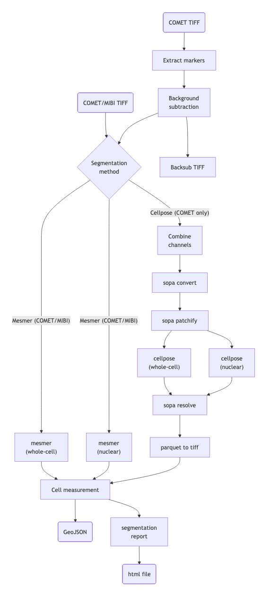

<h1>
  <picture>
    <source media="(prefers-color-scheme: dark)" srcset="docs/images/wehi-soda-hub-spatialproteomics_logo_dark.png">
    
  </picture>
</h1>

[](https://github.com/WEHI-SODA-Hub/spatialproteomics/actions/workflows/ci.yml)
[](https://github.com/WEHI-SODA-Hub/spatialproteomics/actions/workflows/linting.yml)[](https://doi.org/10.5281/zenodo.XXXXXXX)
[](https://www.nf-test.com)

[](https://www.nextflow.io/)
[](https://github.com/nf-core/tools/releases/tag/3.3.2)
[](https://docs.conda.io/en/latest/)
[](https://www.docker.com/)
[](https://sylabs.io/docs/)
[](https://cloud.seqera.io/launch?pipeline=https://github.com/WEHI-SODA-Hub/spatialproteomics)

## Introduction

**WEHI-SODA-Hub/spatialproteomics** is a pipeline for running cell segmentation
on COMET and MIBI data. For COMET, background subtraction can be performed
followed by patched cellpose segmentation, or non-patched mesmer segmentation.
For MIBI, mesmer segmentation can be run. Whole-cell and nuclear segmentations
are run separately, and then consolidated into whole cells with nuclei with full
shape and intensity measurements per compartment. The output GeoJSON files can
be viewed in QuPath.

<details>
  <summary>Click to view Mermaid diagram</summary>
  ```mermaid
  flowchart TD
  A("COMET TIFF") --> B["Extract markers"]
  B --> C["Background
          subtraction"]
  C --> D{"Segmentation
              method"} & O["Backsub TIFF"]
      N("COMET/MIBI TIFF") --> D
      D -- Cellpose (COMET only) --> E["sopa convert"]
      E  --> F["sopa patchify"]
      F --> G["cellpose
              (nuclear)"]
      F --> H["cellpose
              (whole-cell)"]
      G --> I["sopa resolve"]
      H --> I
      I --> J["parquet to tiff"]
      J --> K["Cell measurement"]
      D -- Mesmer (COMET/MIBI) --> L["mesmer
                                     (nuclear)"]
      D -- Mesmer (COMET/MIBI) --> M["mesmer
                                     (whole-cell)"]
      L --> K
      M --> K
      K --> P("GeoJSON")
      K --> Q["segmentation
              report"]
      Q --> R("html file"]
  ```
</details>



The pipeline uses the following tools:

- [Background_subtraction](https://github.com/SchapiroLabor/Background_subtraction)
  -- background subtraction tool for COMET.
- [MesmerSegmentation](https://github.com/WEHI-SODA-Hub/mesmersegmentation) -- a
  CLI for running Mesmer segmentation of MIBI and OME-XML TIFFs.
- [cellmeasurement](https://github.com/WEHI-SODA-Hub/cellmeasurement) -- a
  Groovy app that matches whole-cell segmentations with nuclei, and uses the
  QuPath API to calculate compartment measurements and intensities.
- [sopa](https://github.com/gustaveroussy/sopa) -- we use the sopa CLI tool to
  patchify images and perform cellpose segmentation.

Please see the [docs for more detailed information on pipeline usage and output](docs/README.md)

## Usage

> [!NOTE]
> If you are new to Nextflow and nf-core, please refer to [this page](https://nf-co.re/docs/usage/installation) on how to set-up Nextflow. Make sure to [test your setup](https://nf-co.re/docs/usage/introduction#how-to-run-a-pipeline) with `-profile test` (to test cellpose segmentation) or `-profile test_mesmer` to test mesmer segmentation before running the workflow on actual data.

If you are running this pipeline from WEHI, it has been set up to run on [Seqera Platform](https://seqera.services.biocommons.org.au/).

> [!NOTE]
> If you don't have a .gradle directory in your home, make sure you create it with `mkdir $HOME/.gradle` before runnning the pipeline. You con't need to do this if you are running via WEHI's Seqera Platform mentioned above.

Usage will depend on your desired steps. See [usage docs](docs/usage.md) for more detailed information.

### Background subtraction

> [!NOTE]
> This step will only work with COMET OME-TIF files.

Prepare a sample sheet as follows:

`samplesheet.csv`:

```csv
sample,run_backsub,run_mesmer,run_cellpose,tiff
sample1,true,true,false,/path/to/sample1.tiff
sample2,true,false,true,/path/to/sample2.tiff
```

You may also prefer to use YAML for your samplesheet, either is supported:

`samplesheet.yml`:

```yaml
- sample: sample1
  run_backsub: true
  run_mesmer: true
  run_cellpose: false
  tiff: /path/to/sample1.tiff
- sample: sample2
  run_backsub: true
  run_mesmer: true
  run_cellpose: false
  tiff: /path/to/sample2.tiff
```

> [!WARNING]
> Please ensure that your image name and all directories in your file path do not contain spaces.

If you don't specify any segmentation algorithm to run (mesmer or cellpose), the
pipeline will run a background subtraction only.

Now, you can run the pipeline using:

```bash
nextflow run WEHI-SODA-Hub/spatialproteomics \
   -profile <docker/singularity/.../institute> \
   --input samplesheet.csv \
   --outdir <OUTDIR>
```

> [!WARNING]
> Please provide pipeline parameters via the CLI or Nextflow `-params-file` option. Custom config files including those provided by the `-c` Nextflow option can be used to provide any configuration _**except for parameters**_; see [docs](https://nf-co.re/docs/usage/getting_started/configuration#custom-configuration-files).

### Mesmer segmentation

Before running Mesmer, ensure that you have a [deepcell access token](https://users.deepcell.org/login/)
and that you have set it in your Nextflow secrets:

```bash
nextflow secrets set DEEPCELL_ACCESS_TOKEN $YOUR_TOKEN
```

If you want to run Mesmer as your segmentation algorithm, you can specify a
config file like so:

```csv
sample,run_backsub,run_mesmer,tiff,nuclear_channel,membrane_channels
sample1,true,true,/path/to/sample1.tiff,DAPI,CD45:CD8
sample2,false,true,/path/to/sample2.tiff,DAPI,CD45
```

Nuclear channels only support one entry; membrane channels may have multiple
values separated by `:` characters. If your channels have spaces in them, make
sure that you surround your channel name with quotes. For example, CD45:"HLA I".

You can also set the segmentation parameters for mesmer either via CLI
(e.g., `--combine_method prod` or in a config file pass to the workflow
via `-c`. See [usage](docs/usage.md) for a full list.

> [!WARNING]
> You cannot run both Mesmer and Cellpose segmentation on the same sample (with
> the same name). If you want to run both on a sample, put it on a different
> line and give it a different sample name.

### Cellpose segmentation

If you want to run Cellpose as your segmentation algorithm, you can specify a
config file like so:

```csv
sample,run_backsub,run_cellpose,tiff,nuclear_channel,membrane_channels
sample1,true,true,/path/to/sample1.tiff,DAPI,CD45:CD8
sample2,false,true,/path/to/sample2.tiff,DAPI,CD45
```

As with Mesmer, nuclear channels only support one entry; membrane channels may
have multiple values separated by `:` characters. You can also set the following
parameters, either via CLI (e.g., `--combine_method prod` or in a config
file pass to the workflow via `-c`. See [usage](docs/usage.md) for a full list.

Cellpose will run in a parallelised patched workflow using sopa. To control the
patching process, you can use the `patch_width_pixel` and `patch_overlap_pixel`
parameters.

If you want to skip measurements (this may take some time for large images), you
can use set the parameter `skip_measurements` to `true`.

## Dealing with large images

You can run the pipeline with different profiles for different size images:

- `small`: for images <150GB
- `medium`: for images <300GB
- `large`: for images <600GB

> [!WARNING]
> If you are combining many membrane channels, using `prod` as the combine method
> may lead to large memory usage. In these cases, it is recommended to use `max`
> instead.

## Credits

WEHI-SODA-Hub/spatialproteomics was originally written by the WEHI SODA-Hub.

We thank the following people for their extensive assistance in the development of this pipeline:

- Michael McKay (@mikemcka)
- Emma Watson

## Contributions and Support

If you would like to contribute to this pipeline, please see the [contributing guidelines](.github/CONTRIBUTING.md).

## Citations

<!-- TODO nf-core: Add citation for pipeline after first release. Uncomment lines below and update Zenodo doi and badge at the top of this file. -->
<!-- If you use WEHI-SODA-Hub/spatialproteomics for your analysis, please cite it using the following doi: [10.5281/zenodo.XXXXXX](https://doi.org/10.5281/zenodo.XXXXXX) -->

<!-- TODO nf-core: Add bibliography of tools and data used in your pipeline -->

An extensive list of references for the tools used by the pipeline can be found in the [`CITATIONS.md`](CITATIONS.md) file.

This pipeline was created using the `nf-core` template. You can cite the `nf-core` publication as follows:

> **The nf-core framework for community-curated bioinformatics pipelines.**
>
> Philip Ewels, Alexander Peltzer, Sven Fillinger, Harshil Patel, Johannes Alneberg, Andreas Wilm, Maxime Ulysse Garcia, Paolo Di Tommaso & Sven Nahnsen.
>
> _Nat Biotechnol._ 2020 Feb 13. doi: [10.1038/s41587-020-0439-x](https://dx.doi.org/10.1038/s41587-020-0439-x).
